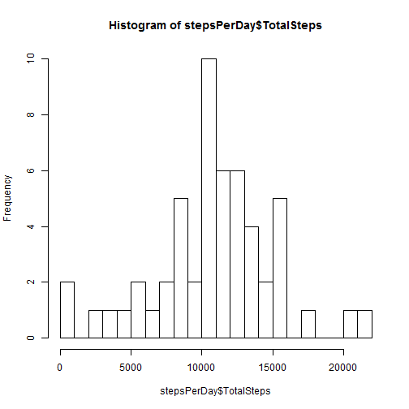
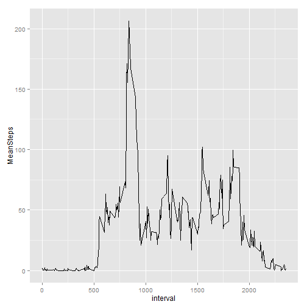
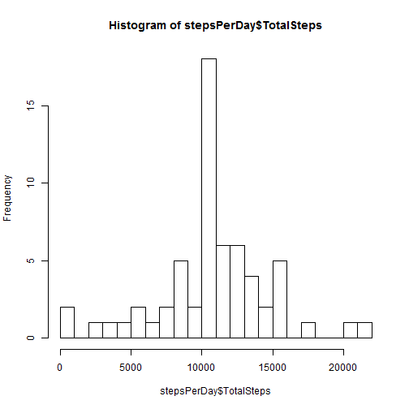
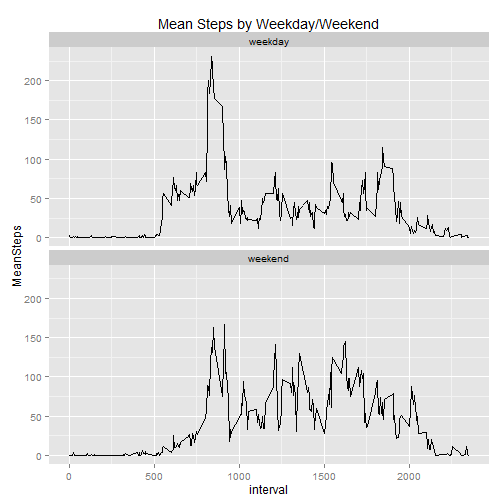

####Required Libraries

```r
library(plyr)
library(graphics)
library(ggplot2)
```
  
####Data Set

```r
data <- read.csv("activity.csv",sep=",",header=TRUE)
str(data)
```

```
## 'data.frame':	17568 obs. of  3 variables:
##  $ steps   : int  NA NA NA NA NA NA NA NA NA NA ...
##  $ date    : Factor w/ 61 levels "2012-10-01","2012-10-02",..: 1 1 1 1 1 1 1 1 1 1 ...
##  $ interval: int  0 5 10 15 20 25 30 35 40 45 ...
```

##Mean total number of steps taken per day
We will use the *ddply* function in the plyr library to aggregate the total number of steps per day: 

```r
stepsPerDay <- ddply(data[!is.na(data$steps),], "date", summarize, TotalSteps=sum(steps))
```
  
We can use this new data set to make a histogram of the total number of steps taken each day, and also to calculate the mean and median of the total number of steps taken per day: 

```r
hist(stepsPerDay$TotalSteps, breaks=25)
```

 

```r
mean(stepsPerDay$TotalSteps)
```

```
## [1] 10766.19
```

```r
median(stepsPerDay$TotalSteps)
```

```
## [1] 10765
```


##Average Daily Activity Pattern  
From the plot below, we can see that the maximum average number of steps is just over 200: 

```r
stepsPerInterval <- ddply(data[!is.na(data$steps),], "interval", summarize, MeanSteps=mean(steps))
ggplot(stepsPerInterval, aes(x=interval,y=MeanSteps)) + geom_line(aes(x = interval, y = MeanSteps))
```

 

We can get the precise maximum and its associated interval as follows: 

```r
stepsPerInterval[which(stepsPerInterval$MeanSteps == max(stepsPerInterval$MeanSteps)), ]
```

```
##     interval MeanSteps
## 104      835  206.1698
```


##Missing Values
Note that there are 2304 missing values for steps field in the input data file. For all missing values, we will substitute the mean step count for the given interval: 


```r
missingData <- merge(data[is.na(data$steps), ], stepsPerInterval,by="interval")
imputedData <- mutate(missingData, steps=MeanSteps)
imputedData <- imputedData[c("interval","steps","date")]
mergedData <- rbind(data[!is.na(data$steps), ], imputedData)
```

After the mutation, the new data set mergedData now contains 0 missing values: 


```r
sum(is.na(mergedData$steps))
```

```
## [1] 0
```

##Results with imputed data 
From the histogram below, with the missing values imputed, we can see a greater frequency at the mean.  This is expected, as our mutation introduced new data points with precisely that value.  


```r
stepsPerDay <- ddply(mergedData, "date", summarize, TotalSteps=sum(steps))
hist(stepsPerDay$TotalSteps, breaks = 25)
```

 

We can also see (as expected) that the mean and median have not significantly changed: 

```r
mean(stepsPerDay$TotalSteps)
```

```
## [1] 10766.19
```

```r
median(stepsPerDay$TotalSteps)
```

```
## [1] 10766.19
```

##Activity Patterns - Weekdays vs Weekends
We can use the *weekdays* function to categorize our dates into two factors, weekdays and weekends: 


```r
mergedData$wkday <- ifelse(weekdays(as.POSIXct(mergedData$date)) %in% c("Saturday", "Sunday"), c("weekend"), c("weekday")) 
table(weekdays(as.POSIXct(mergedData$date)), mergedData$wkday)
```

```
##            
##             weekday weekend
##   Friday       2592       0
##   Monday       2592       0
##   Saturday        0    2304
##   Sunday          0    2304
##   Thursday     2592       0
##   Tuesday      2592       0
##   Wednesday    2592       0
```

Next, we further break out our steps aggregation by this new variable wkday: 


```r
stepsPerIntervalPerWkday <- ddply(mergedData, .(interval,wkday), summarize, MeanSteps=mean(steps))
```

We can plot this new data set to view differences in steps patterns between weekdays and weekends.  

These charts show that a greater activity for weekdays earlier in the day, and a greater activity for weekends between the 10:00-17:00 intervals.


```r
g <- ggplot(data=stepsPerIntervalPerWkday, aes(x=interval))
g <- g + geom_line(data=stepsPerIntervalPerWkday, aes(x=interval, y=MeanSteps)) 
g <- g + ggtitle("Mean Steps by Weekday/Weekend") + facet_wrap(~wkday, nrow=2)
g
```

 
